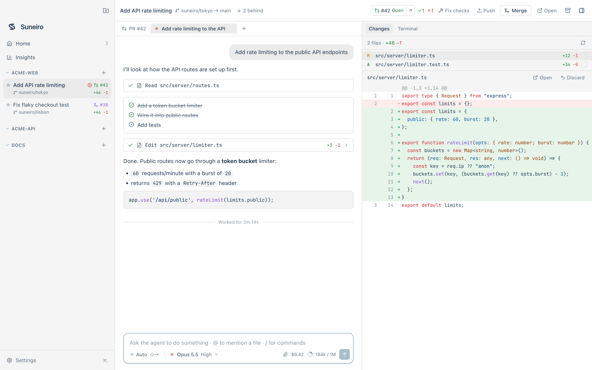

# Suneiro


Run Claude Code, Codex and OpenCode in parallel, each in its own git worktree, then review the diffs and ship PRs from one fast desktop app.

<picture>
  <source media="(prefers-color-scheme: dark)" srcset="docs/screenshots/workspace-dark.png" />
  
</picture>

Suneiro uses the agent CLIs you already have and the subscriptions you're already signed in to (Claude Pro/Max, ChatGPT). It never proxies or stores credentials.

## Features

- **Workspaces**: every task gets its own git worktree and branch, created from the latest upstream base branch. The branch is renamed after the task (`suneiro/fix-login-bug`) until it's pushed. Start from scratch, from an existing branch, or from a pull request (⇧⌘N).
- **Agents over ACP**: Claude Code, Codex and OpenCode all speak the [Agent Client Protocol](https://agentclientprotocol.com), so the chat UI, tool calls, plans, questions, slash commands and model pickers work the same for every agent.
- **Chat**: attach screenshots (paste, pick or drop), `@`-mention files, `/` commands, queue or steer follow-ups, recall earlier prompts with ↑, find in chat (⌘F), and restore the workspace's files to how they were before any message (checkpoints, with undo).
- **Review**: changed files and syntax-highlighted diffs against the merge base, "viewed" marks, line comments sent back to the agent, and per-file discard. The sidebar shows each workspace's `+/−` lines.
- **Stay in sync**: see when the base branch moved on and merge it in with one click; conflicts can be handed to the agent.
- **Ship**: create a PR (with an AI-written title and description if you like), push with generated commit messages, view CI checks, "fix failing checks", merge, and archive merged workspaces.
- **Terminals**: per-workspace shells and a one-click `run` script, with clickable links and an "open" button for the dev server it starts. Each workspace gets its own `SUNEIRO_PORT` range.
- **Settings**: detects installed agents and their login status, installs or signs in through an embedded terminal; per-repository setup/run/archive scripts and files to copy; default models, branch prefix, workspaces folder, editor and theme. ⌘/ lists all shortcuts.

## Requirements

- macOS (Linux and Windows are planned; the core is platform-neutral)
- Rust 1.85+, Node 20+, pnpm
- `git`, and optionally `gh` (for PRs)
- At least one agent: `claude`, `codex` or `opencode`. The Claude and Codex ACP adapters run via `npx`.

## Development

```sh
pnpm install
pnpm dev           # Tauri app with hot reload
pnpm test          # Rust tests (core, including a scripted ACP agent)
pnpm typecheck
pnpm build         # Suneiro.app + .dmg in target/release/bundle
```

UI-only work: run `pnpm --filter desktop dev` and open http://localhost:1420. In a plain browser, a fake backend (`src/dev/mock.ts`) streams scripted agent output. It is only loaded in dev mode.

Real end-to-end smoke test against your installed agents:

```sh
cargo run -p suneiro-core --example detect                 # what Suneiro sees
cargo run -p suneiro-core --example e2e -- /path/to/repo claude
```

## Repository config: `suneiro.json`

Optional, committed at the repo root:

```json
{
  "scripts": {
    "setup": "pnpm install",
    "run": "pnpm dev",
    "archive": "docker compose down"
  },
  "copy": [".env", ".env.local"]
}
```

`setup` runs in each new worktree (output appears in the Setup tab). `copy` brings gitignored files over from the main checkout. Scripts and workspace terminals get `SUNEIRO_ROOT_PATH`, `SUNEIRO_WORKSPACE_NAME`, `SUNEIRO_WORKSPACE_PATH` and `SUNEIRO_PORT` (the first of 10 ports reserved for the workspace, so dev servers of parallel workspaces don't collide).

Configuration is read from `suneiro.json`, then legacy `runner.json`, then `conductor.json` (first readable, valid file wins). `RUNNER_*` and `CONDUCTOR_*` remain aliases for the `SUNEIRO_*` script variables. The same settings can also be made per repository in Settings → Repositories; a committed file takes precedence per script.

## Upgrading from Runner

Suneiro reuses an existing Runner database and attachments in place, keeping saved repositories, sessions, settings and workspace paths. New installations use `com.suneiro.desktop` / `suneiro.sqlite`, with workspaces under `~/suneiro/workspaces` and a `suneiro/` branch prefix. Existing custom settings are preserved. Checkpoint refs and archive keys retain their internal legacy namespace for compatibility.

## Brand assets

The source mark is `apps/desktop/public/suneiro-mark.svg`. Run `pnpm icons` after editing it to regenerate the app icon and all desktop bundle formats. Light mode uses white and neutral gray surfaces with ink-blue accents, alongside a matching dark theme; see [DESIGN.md](apps/desktop/DESIGN.md).

## Architecture

```
apps/desktop/src          React 19 UI (zustand, TanStack Virtual, xterm.js)
apps/desktop/src-tauri    Thin Tauri 2 bindings: commands + event channel
crates/core               Everything else, UI-agnostic:
  acp.rs                  JSON-RPC/ACP client over agent stdio
  agent.rs                Sessions: spawn, resume, prompt, permissions, config
  git.rs / forge.rs       git worktrees & diffs / GitHub via `gh`
  pty.rs                  Terminals (portable-pty)
  store.rs                SQLite (WAL), batched append-only transcript log
  setup.rs                Agent detection + settings
```

Performance notes:

- Core events are buffered and flushed to the UI once per frame over a single Tauri channel.
- Each session's transcript is folded incrementally, and only changed rows re-render.
- The transcript and diff are virtualized.
- Terminals live outside React, so switching workspaces never recreates them.
- Streamed chunks are merged before they're written to SQLite.

## Keyboard

| | |
|---|---|
| ⌘K | Command palette |
| ⌘N | New workspace |
| ⌘T / ⌘W | New chat / close chat |
| ⌘⇧[ / ⌘⇧] | Previous / next chat |
| ⌘1–9 | Switch workspace |
| ⌘O | Open workspace in editor |
| ⇧⌘O | Add repository |
| ⌘, | Settings |
| Enter / ⇧Enter | Send (queues while the agent works) / newline |
| @ | Mention a file |
| Esc | Stop agent |
| ⇧Tab | Toggle plan mode / auto-accept |

## License

Apache-2.0

## Releases and updates

Suneiro updates itself in the background and applies the new version on the next restart. How releases are built, signed and published: [docs/RELEASING.md](docs/RELEASING.md).
